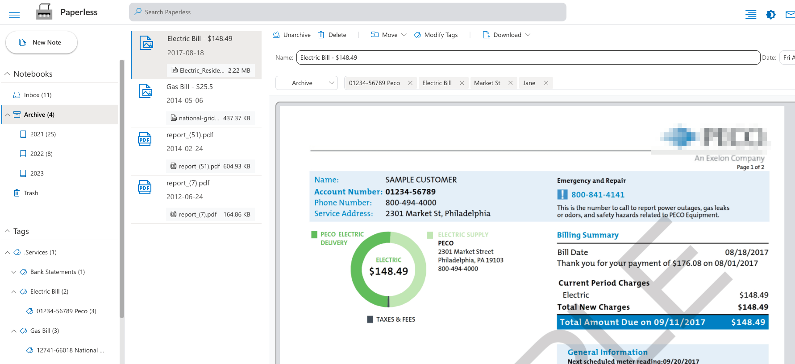

# paperless.node

An alternative to Evernote specifically intended for indexing scanned paperwork/PDFs/mail in a private and trust-no-one architecture.

## Introduction

Following my [blogpost from 2012](https://uri.agassi.co/2012/09/29/going-paperless-using-evernote/) about using Evernote for indexing
your paperless office, Evernote has changed their service to lend itself less and less to my needs. That, with other shortcomings of
their solution (like a single gigantic blob to hold my private notebook, which taxed my backup system), I've decided to write my own
version using a [.Net desktop solution](https://dev.azure.com/uriagassi/Paperless).

This is a new web implementation, meant to be deployed on your local machine, or in your local intra network. It uses the same concepts,
but is cleaner, leaner, and more available to non-Microsoft-centric machines.

# Getting Started

## Deployment
The easiest way to use this application, is to install it locally on your machine

1. Install [Node.js](https://nodejs.org/en/) and [yarn](https://classic.yarnpkg.com/lang/en/docs/install/)
2. Clone this repo locally
3. Build the app

```console
paperless.node:~$ yarn install
paperless.node:~$ yarn build
```        
4. Run the Setup Wizard

```console
paperless.node:~$ yarn setup_wizard 
```

     Fill up the location where you want your database to be in. You can skip the rest of the wizard for now.
5. Run the app
```console
paperless.node:~$ yarn start_prod
```

You can now see your database by going to http://localhost:3000

# Basic Operation

At this basic level, you can add notes by clicking the "Add Note" button. You can change the title of the added note, its "Create Date" and add tags.

When you are done - click the `Archive` button, and it will be moved to the Archive Notebook.

Rinse and Repeat.

# Integrations

You might want to better integrate a few more tools to your paperless work-flow. Currently - there are two main tools you can integrate into the paperless.node - your Scanner, and your Gmail.

## Scanner

Most scanners scan to a JPG or a PDF, and sends the file to a folder on your disk.

You can configure paperless.node to "listen" to that folder, show you when there are files on it, and if you press the "Import" button - will automatically add those files to the `Inbox`, and delete them from the scanner folder.

To do that, in the `setup_wizard` configure the scanner folder:

```console {highlight="context:/path,1"}
paperless.node:~$ yarn setup_wizard
What path should the DB be in? [~/paperless]
What path should the files waiting from the scanner be in? [~/importToPaperless] /path/to/my/awsome/scanner
```
To use this feature look for the scanner button on the upper right command bar , if there are new scanned files in that
folder, you will see a bubble with the number of pending files. Pressing the button will import every file in the folder into its own new note, and 
delete it from the scanner folder.

## Gmail
When you get mail you want to index in paperless.node, or perhaps there is a digital file you want to add, but the app is not reachable 
(you are on mobile, or in your work computer), it could be very convenient if you could simply send this mail/file straight to the app.

You can do it by assigning a label to this mail, and tell paperless.node to import all mail items that contain that label.

Since this is an open source project, and does not include its own app_api, the integration with Gmail entails a few steps:

### Step 1: Obtain a credentials.json file from Google Cloud
1. [Create a new GCP Project](https://developers.google.com/workspace/guides/create-project)
2. [Enable Gmail APIs](https://console.cloud.google.com/apis/library/gmail.googleapis.com)
3. [Create an OAuth Client ID](https://developers.google.com/workspace/guides/create-credentials#oauth-client-id)
    1. In the `Authorized JavaScript Origins` enter the root of the Paperless App (as long as you are running it locally - it should be `http://localhost:3000`)
    2. In the `Authorized redirect URIs` enter the same value you've set in the previous step, but with the `/gmail` path (i.e. `http://localhost:3000/gmail`)
4. Download the OAuth Client
    
